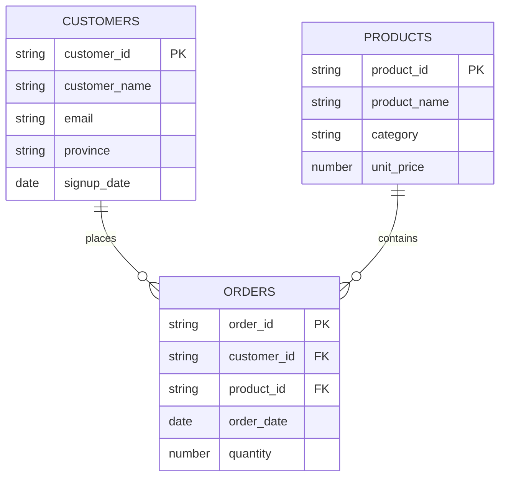

# DE_PROJECT1
# Data Engineering Project 1

**Platform: Snowflake only.** Work done in any other tool will not be marked.

## Data provided

| File | Rows | Columns | Role |
|---|---|---|---|
| customers.csv | 50 | customer_id, customer_name, email, province, signup_date | Dimension |
| products.csv | 20 | product_id, product_name, category, unit_price | Dimension |
| orders.csv | 150 | order_id, customer_id, product_id, order_date, quantity | Fact |

Do not edit the source CSVs.

## Data model

## What you need to do

1. Create a database and schema in Snowflake for this project. Name it clearly, for example `DE_PROJECT1`.
2. Load all three CSVs into Snowflake tables. Use correct data types per column, not VARCHAR for everything.
3. Confirm your load. Run `SELECT COUNT(*)` on each table and check: customers = 50, products = 20, orders = 150.
4. Write and run these four queries, and keep the SQL for each:
   - Every order joined to customer name, product name, category, and a calculated `line_revenue` (quantity times unit_price).
   - Total revenue per customer.
   - Total revenue per product category.
   - Top 5 customers by total spend.
5. Write one short paragraph per query explaining what it shows and why it matters.

## What gets marked

| Item | Points |
|---|---|
| Database and tables created in Snowflake, correct types | 20 |
| Successful load, row counts confirmed | 15 |
| Query 1: order detail join | 15 |
| Query 2: revenue per customer | 15 |
| Query 3: revenue per category | 15 |
| Query 4: top 5 customers | 10 |
| Write-up quality (clear, correct, ties back to the data) | 10 |
| **Total** | **100** |

## What to submit

- Screenshot of your Snowflake database, schema, and tables
- The load statements you used (COPY INTO or equivalent)
- A `.sql` file with all four queries
- Results for each query (screenshot or CSV export)
- Your write-up paragraphs

**Deadline: 14 September 2026.** Late work without prior arrangement is not marked.

This is Project 1. It feeds directly into the capstone (`BrightLearn_Snowflake_Capstone.md`), which assumes you can already load and join data in Snowflake on your own.
